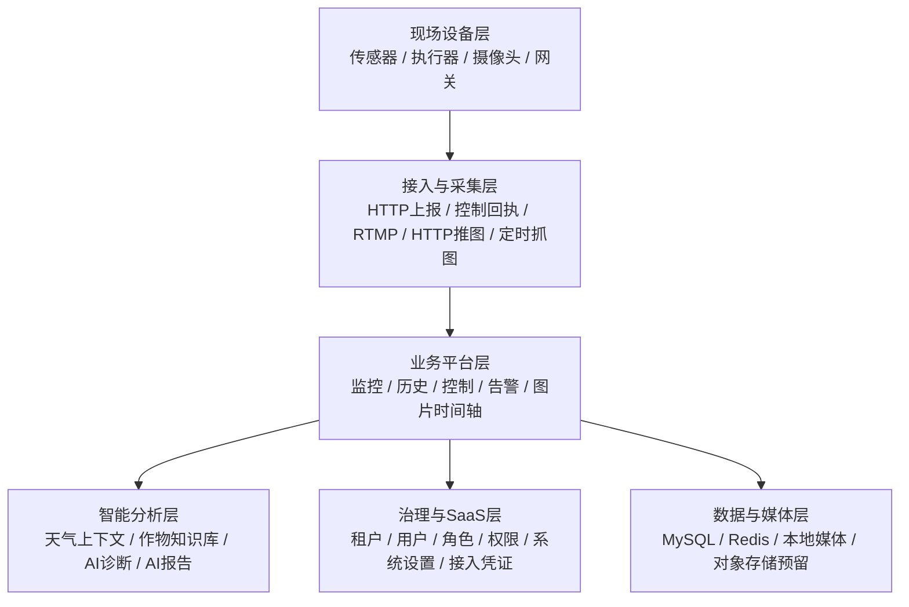

# 架构评审稿

## 一、评审结论

当前系统已经不是 Demo 或 PoC，而是一个具备生产底座的农业 IoT 平台，并且已经完成了多租户 SaaS 演进所需的关键预埋。

整体判断如下：

- 产品形态：已进入可交付、可部署、可持续演进阶段
- 架构形态：单体平台为主，模块边界清晰，适合当前阶段
- 多租户能力：已具备 `tenant_id` 行级隔离和租户化登录、配置、设备接入底座
- 摄像头链路：已形成“推流/抓图/入库/时间轴预览”的完整闭环
- 智能分析能力：已具备天气上下文、作物知识库和 AI 诊断/报告入口，但深度仍受知识库与数据质量约束

一句话结论：

**当前系统已经具备生产底座和 SaaS 演进能力，下一阶段重点不在重构，而在协议化接入、媒体对象存储和任务调度能力补强。**

---

## 二、当前产品架构概览

从代码结构看，当前模块边界已经较清晰：

- 后端主模块入口：[/Users/mac/Documents/New project/agri-platform/admin-api/src/server.js](/Users/mac/Documents/New%20project/agri-platform/admin-api/src/server.js)
- 前端产品模块分域：[/Users/mac/Documents/New project/agri-platform/admin-web/src/config/modules.js](/Users/mac/Documents/New%20project/agri-platform/admin-web/src/config/modules.js)

---

## 三、六层成熟度评估

| 层级 | 成熟度 | 当前判断 | 核心短板 |
| --- | --- | --- | --- |
| 现场设备层 | ★★★☆☆ | 传感器、执行器、摄像头已接入，现场闭环已跑通 | 多协议能力偏弱，仍依赖边缘适配 |
| 网关接入层 | ★★★☆☆ | HTTP 上报、控制回执、抓图链路已可用 | 协议中心尚未建立，MQTT / Modbus TCP 尚未平台化 |
| 业务平台层 | ★★★★☆ | 监控、历史、控制、告警、影子状态、图片时间轴完整 | 页面治理和导航体验仍需持续打磨 |
| 智能分析层 | ★★★☆☆ | 作物知识库、天气、AI 诊断/报告底座已形成 | 知识库深度与模型输入质量决定上限 |
| 治理与 SaaS 层 | ★★★★☆ | 多租户、权限、配置、租户管理已经预埋较完整 | 套餐/订阅运营层尚未正式启用 |
| 数据与媒体层 | ★★★☆☆ | MySQL / Redis / 本地媒体链路可用，媒体元数据模型正确 | COS/MinIO 尚未真正切通，任务调度未彻底队列化 |

综合评分建议：

- 以当前阶段目标评价：**8.2 / 10**
- 以成熟商业 SaaS 平台评价：**6.8 / 10**

---

## 四、当前最值得保留的设计决策

### 1. 行级多租户隔离

采用 `tenant_id` 做行级隔离，而不是一开始就做独立库/独立 schema，是当前阶段正确的权衡。

价值在于：

- 运维成本低
- 部署成本可控
- 新租户接入不需要额外数据库编排
- 后续仍可继续演进到更重的 SaaS 架构

只要后续查询、索引和缓存继续围绕租户维度收口，这套模型还可以支撑相当长时间。

### 2. 摄像头闭环不是“登记地址”，而是真业务链

当前摄像头能力已经不是简单地把 RTSP/RTMP 地址记在数据库里，而是形成了完整链路：

- RTMP 推流
- HTTP 图片推送
- 手动抓图
- 定时抓图
- 快照入库
- 时间轴预览

这是实打实的媒体业务闭环，而不是附属挂件。

### 3. 作物知识库方向是对的

作物知识库把产品价值从：

- “展示监测数据”

提升为：

- “给出种植建议和目标区间”

这一步意味着平台已经开始从监控系统向种植决策系统延伸，方向是正确的。

---

## 五、当前最需要补齐的三个方向

### 1. 接入层协议化

当前协议接入主要依赖边缘侧或设备侧适配，短期可行，但长期会提高现场部署和维护成本。

建议目标：

- 平台侧逐步标准化 `HTTP / MQTT / Modbus TCP`
- 保留边缘适配模式，但不再把所有协议差异都丢给现场解决
- `RTSP / ONVIF` 放到下一阶段，不宜无限期推迟

建议优先级：

1. HTTP
2. MQTT
3. Modbus TCP
4. RTSP / ONVIF

### 2. 媒体层对象存储切换

本地文件系统适合当前单机部署，但它不是长期横向扩展的最终方案。

当前系统已经具备切换对象存储的基础条件：

- 数据库只保存元数据和对象键
- 媒体路径已经按租户组织
- 页面已支持 `fileUrl / thumbnailUrl`

建议优先切换顺序：

1. 快照图片
2. 缩略图
3. HLS/录像等更重媒体对象

建议目标：

- 正式切通 COS 或 MinIO
- 历史数据迁移保持按 `tenant/` 路径组织

### 3. 可观测性与任务队列

当前系统已经存在多类天然适合队列化的任务：

- 定时抓图
- AI 诊断/报告
- 告警联动
- 后续通知重试

如果继续用简单同步逻辑或轻量定时轮询，随着任务密度上升，会逐步触碰单体进程稳定性边界。

建议路径：

- 先引入 `BullMQ + Redis`
- 优先把定时抓图和 AI 报告切进队列
- 后续再把通知与告警动作也逐步迁入

---

## 六、关于单体架构的拆分时机

当前阶段不建议为了“看起来先进”而强行微服务化。

正确的拆分顺序应该是按负载特征拆，不是按技术层拆。

### 第一优先拆分：媒体调度服务

原因：

- 抓图
- 转码
- HLS 切片
- 后续录像处理

这类任务天然是 CPU/IO 密集型，和业务 API 放在同一进程会互相抢资源。

### 第二优先拆分：设备接入服务

原因：

- 设备上报
- 长连接
- 高频状态流
- 协议适配

这些流量特征与后台管理 API 差异很大，独立后更利于连接和任务管理。

### 暂时不建议拆分的部分

以下模块在相当长时间内仍可保留在业务单体中：

- 监控
- 历史分析
- 告警
- AI 业务编排
- 治理与权限

---

## 七、当前最大的产品定义风险

当前系统里，最值得提前想清楚的不是技术，而是智能分析的产品定义。

关键问题是：

- 作物知识库由谁维护
- 维护频率是多少
- 目标区间的依据是否可追溯
- AI 诊断到底是规则增强，还是大模型推理
- 当前输入数据是否足以支持有说服力的建议

如果 AI 的输入只有：

- 传感器值
- 天气上下文

那么诊断深度会天然受限。

因此建议后续把智能分析分成两层：

1. **结构化知识层**
   - 作物
   - 品种
   - 生长阶段
   - 目标区间
   - 来源依据

2. **生成式解释层**
   - AI 负责把结构化目标与当前实测值转成建议和报告
   - 而不是直接凭空生成阈值

---

## 八、下一阶段建议路线

### 第一阶段

- 引入任务队列
- 抓图与 AI 报告先队列化

### 第二阶段

- 切通对象存储
- 图片先切，视频后切

### 第三阶段

- 平台侧协议化接入
- 建立轻量协议中心

### 第四阶段

- 视设备量与媒体量情况拆出媒体调度服务、设备接入服务

---

## 九、最终结论

当前系统已经完成了从原型到平台底座的跨越。

它的优点不在于“页面很多”，而在于几条真正有价值的链路已经打通：

- 设备采集链
- 控制闭环链
- 影子对账链
- 摄像头抓图链
- 多租户治理链
- 作物知识与 AI 扩展链

因此，当前阶段最合理的策略不是推翻重做，而是围绕以下三点继续补强：

- 接入层协议化
- 媒体对象存储
- 队列与可观测性

一句话结论：

**当前系统已经具备生产底座和 SaaS 演进能力，下一阶段重点是增强接入、媒体和调度能力，而不是重新设计整体架构。**
